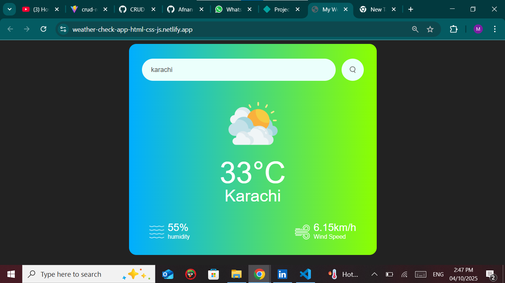

# 🌦️ Weather App

A simple weather application built with **HTML, CSS, and JavaScript** that fetches real-time weather data using the [OpenWeatherMap API](https://openweathermap.org/).

---

## ✨ Features

* Search weather by city name.
* Displays:

  * 🌡️ Temperature (°C)
  * 🌍 City Name
  * 💧 Humidity
  * 🌬️ Wind Speed
* Shows different weather icons based on the condition (Clear, Clouds, Rain, Snow, etc.).
* Handles invalid city names with an error message.

---

## 🚀 Getting Started

### 1. Clone the Repository

```bash
git clone https://github.com/Afnan-coder/weatherApp.git
cd weatherApp
```

### 2. Get OpenWeatherMap API Key

* Sign up at [OpenWeatherMap](https://openweathermap.org/).
* Generate your **API Key**.
* Replace the placeholder in `script.js`:

  ```js
  const apiKey = "Enter your api key from OpenWeatherMap.org";
  ```

### 3. Open the App

Simply open `index.html` in your browser.

---

## 🖼️ Screenshots



---

## ⚡ Technologies Used

* **HTML5**
* **CSS3**
* **JavaScript (Vanilla)**
* **OpenWeatherMap API**


